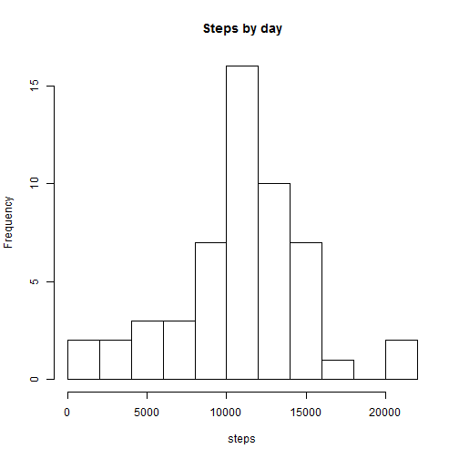
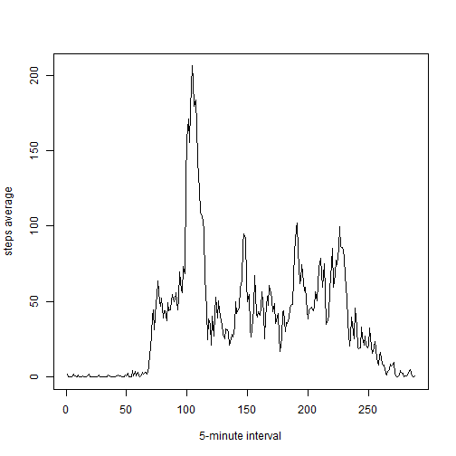
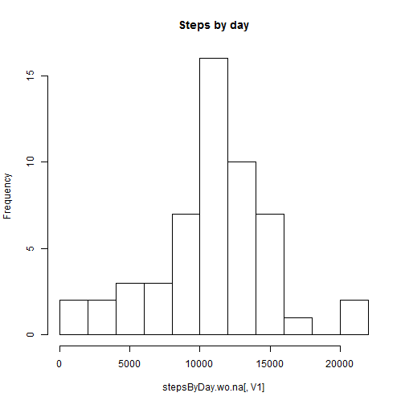
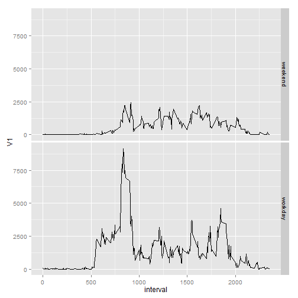

# Reproducible Research: Peer Assessment 1


## Loading and preprocessing the data
I load the activity data and generate data.table

```r
library(data.table)
setwd("C:/Users/mbonoli/Dropbox/Cursos Tomados/Reproducible Research/Peer Assignment 1/")
data <- read.csv("activity.csv")
activity <- data.table(data)
```


## What is mean total number of steps taken per day?

```r
stepsByDay <- activity[,sum(steps),by=date]
hist(stepsByDay[,V1],breaks=12, main="Steps by day", xlab="steps")
```

 

```r
ave <- mean(stepsByDay[,V1], na.rm=T)
med <- median(stepsByDay[,V1], na.rm=T)
```
The average of total number of steps taken per day is

```r
round(ave,1)
```

```
## [1] 10766
```
and the median is

```r
med
```

```
## [1] 10765
```


## What is the average daily activity pattern?

```r
stepsAcrossDay <- activity[,mean(steps,na.rm=T),by=interval]
plot(stepsAcrossDay[,V1],type='l',xlab="5-minute interval", ylab="steps average")
```

 

```r
maxsteps <- stepsAcrossDay[stepsAcrossDay$V1 == max(stepsAcrossDay$V1),]
```
The maximum number of steps is

```r
maxsteps$V1
```

```
## [1] 206.2
```
and the 5-minute interval is

```r
maxsteps$interval
```

```
## [1] 835
```


## Imputing missing values

```r
summary(activity)
```

```
##      steps               date          interval   
##  Min.   :  0.0   2012-10-01:  288   Min.   :   0  
##  1st Qu.:  0.0   2012-10-02:  288   1st Qu.: 589  
##  Median :  0.0   2012-10-03:  288   Median :1178  
##  Mean   : 37.4   2012-10-04:  288   Mean   :1178  
##  3rd Qu.: 12.0   2012-10-05:  288   3rd Qu.:1766  
##  Max.   :806.0   2012-10-06:  288   Max.   :2355  
##  NA's   :2304    (Other)   :15840
```
The total number of missing values in the dataset is

```r
sum(is.na(activity$steps))
```

```
## [1] 2304
```


```r
activity.wo.na <- activity[,steps.wo.na:=mean(steps, na.rm=T),by=interval]
stepsByDay.wo.na <- activity.wo.na[,sum(steps),by=date]
hist(stepsByDay.wo.na[,V1],breaks=12, main="Steps by day")
```

 

```r
ave <- mean(stepsByDay.wo.na[,V1], na.rm=T)
med <- median(stepsByDay.wo.na[,V1], na.rm=T)
```
The average of total number of steps taken per day is

```r
round(ave,1)
```

```
## [1] 10766
```
and the median is

```r
med
```

```
## [1] 10765
```
These values don't differ from the first part of the assignment.

## Are there differences in activity patterns between weekdays and weekends?

```r
activity$weekday <- weekdays(as.Date(activity$date), abbreviate=T)
activity$daytype <- "workday"
activity$daytype[activity$weekday=='sáb' | activity$weekday=='dom'] <- "weekend"
stepsAcrossDay <- activity[,sum(steps,na.rm=T),by=c("interval", "daytype")]
library(ggplot2)
ggplot(data=stepsAcrossDay, aes(x=interval, y=V1, group=daytype))+geom_line()+facet_grid(daytype ~ .)
```

 
The profiles show variations between working days and weekends. Especially in the morning.
